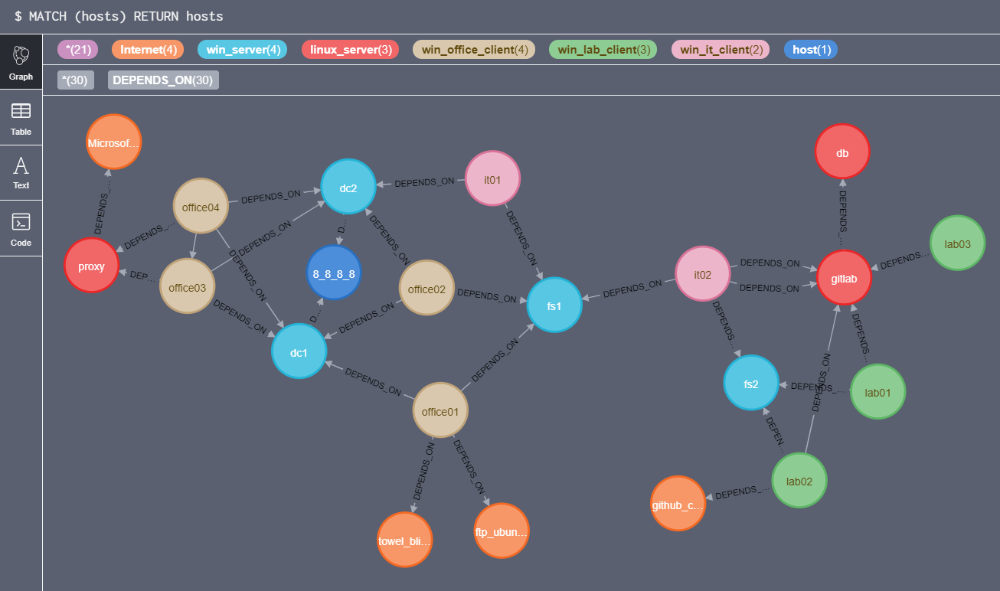

# Netstat Visualization with Neo4j



## Description
Graphs help to spot anomalies and patterns in large datasets.  
This script takes netstat information from multiple hosts and formats them in a way to make them importable into Neo4j.  
Neo4j can be queried for find connections to certain hosts, from certain hosts, find out the usage or protocols and much more.

## Example Files
There are already some files in the example directory for you to be able to test the tool.  
you can also find example queries which will help you to have a basic idea of the possibilities of the search

## Status
Currently the tool is tested with the netstat output of Windows systems using the command 'netstat -an'

## Setup

### Install docker and docker-compose
https://docs.docker.com/install/linux/docker-ce/centos/  
https://docs.docker.com/compose/install/  

### Extract Files
```
git clone https://github.com/trinitor/netstat2neo4j.git /opt/netstat2neo4j/
```

### Start Container
```
cd /opt/netstat2neo4j/
docker-compose up -d
```

### Test Logon
https://ip:7474  
user: neo4j  
pass: neo4j

### Upload Netstat Files
copy all netstat out files (*.txt files) into /opt/netstat2neo4j/script/import/

### Create Cypher Statements for Neo4j
```
cd /opt/netstat2neo4j/script/
bash csv2neo4j.sh
```
the needed cypher statements can be found in create_database.txt

### Create Database 
browse to https://localhost:7474  
Copy content from create_database.txt  
Paste into the command bar of the neo4j interface

### Example Query
```
MATCH (src)-[:DEPENDS_ON]->(dst)
WHERE src.ip STARTS WITH '192_168_'
RETURN src, dst
```
There is a query.txt in the example folder as well.

## Q&A

**Q:** This is redundant. Don't you know there are other projects?  
**A:** I do. This is not new or special. There are free projects, tutorials and commercial products based on agents to draw maps and even enforce rules.  
Some examples:  
- https://www.maltego.com
- https://www.tanium.com/products/map/
- https://www.illumio.com/
- https://www.cisco.com/c/en/us/products/security/tetration/  

This small project is by no means a replacement.

**Q:** Creating netstats on all machines is hard. Do you have a solution?  
**A:** 
While you can collect the information with WMI/PowerShell remoting I do not recommend to have an account that has full admin rights on all your systems.  
Use your configuraiton managment to schedule the netstat creation or use schedulded tasks. This is out of scope for this small little project.  
If you want to use an account with all the keys to the kindom:  
https://ijustwannared.team/2019/04/22/network-connection-footprinting-with-wmi-and-neo4j/

**Q:** You must be wrong. Neo4j must be able to read CSV files directly. Why are you creating the statements by yourselve?  
**A:** You are right. It is possible to import CSV files directly.  
https://neo4j.com/developer/guide-import-csv/  
